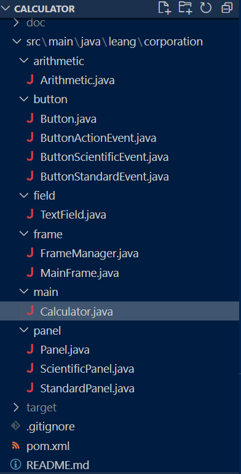
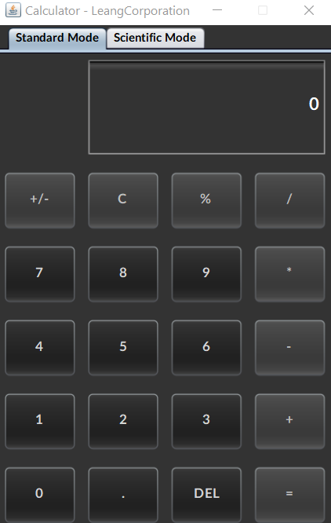
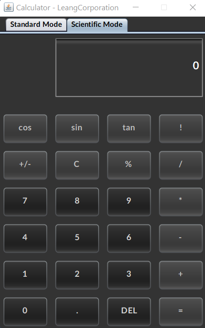

# Java Calculator

<!-- TABLE OF CONTENTS -->
<details>
  <summary>Table of Contents</summary>
  <ol>
    <li>
      <a href="#about-the-project">About The Project</a>
      <ul>
        <li><a href="#built-with">Built With</a></li>
        <li><a href="#more-details">More details</a></li>
      </ul>
    </li>
    <li>
      <a href="#getting-started">Getting Started</a>
      <ul>
        <li><a href="#prerequisites">Prerequisites</a></li>
      </ul>
    </li>
    <li><a href="#usage">Usage</a>
      <ul>
        <li><a href="#how-to-run">How to run</a></li>
        <li><a href="#how-to-use">How to use</a></li>
        <li><a href="#what-is-supported">What is supported</a></li>
      </ul>
    </li>
    <li><a href="#contact">Contact</a></li>
  </ol>
</details>

<!-- ABOUT THE PROJECT -->
## About The Project

This calculator is a simpler version of the built in Windows calculator. It supports both basic arithmetic operations (addition, subtraction, multiplication, division, modulo) and some scientific ones (cosine, sine, tangent, factorial). It is written in Java mainly using Swing library and is a Maven project.

### Built With

* [Swing](https://docs.oracle.com/javase/7/docs/api/javax/swing/package-summary.html)
* [Nimbus L&F](https://docs.oracle.com/javase/tutorial/uiswing/lookandfeel/nimbus.html)

### More details

The code is already commented so a javadoc can easily be generated after importing the project.

<p align="right">(<a href="#top">back to top</a>)</p>

<!-- GETTING STARTED -->
## Getting Started

### Prerequisites

Clone the repository with SSH or HTTPS
   ```sh
   git clone git@github.com:YeriAddict/Calculator.git
   ```
   ```sh
   git clone https://github.com/YeriAddict/Calculator.git
   ```
<p align="right">(<a href="#top">back to top</a>)</p>

<!-- USAGE EXAMPLES -->
## Usage

### How to run

1. After importing the project, you just need to run the Calculator.java file  :



2. You are now in standard mode and can computate standard operations :



3. You can also switch to the scientific mode and computate four special operations (cos, sin, tan, factorial)



### How to use

Using this calculator is straightforward. It is possible to delete one character at a time by clicking on DEL button. Clicking C button will simply reset the calculator back to default state.

**For standard operations (+-*/%):**
1. Enter the first number by clicking on numerical digit, dot and sign switching buttons
2. Click on any operator button and the first number will be stored, resetting the output in the screen
3. Enter the second number
4. Click equal button to get the result

**For scientific operations (cos, sin, tan, !) :**
1. Enter the first number by clicking on numerical digit, dot and sign switching buttons
2. Click on any scientific button to get the result

### What is supported 

This calculator can currently support these functionalities:  
➢ Operation chaining (example: clicking [2] [+] [3] [=] [-] [2] [=] will return 3)  
➢ Operations with negative operands  
➢ Successive operations when clicking equal multiple times: the last entered number is the operand with which the operation is made (example: clicking [2] [+] [3] [=] will return 5, [=] will return 8, [=] will return 11 …)  
➢ Operands belonging to [-1,1] range  
➢ Sign switching with a button  
➢ Factorial in the [-142,22; 141,22] range  

<p align="right">(<a href="#top">back to top</a>)</p>

<!-- CONTACT -->
## Contact

LEANG Denis - denis.leang@telecom-st-etienne.fr 

<p align="right">(<a href="#top">back to top</a>)</p>
